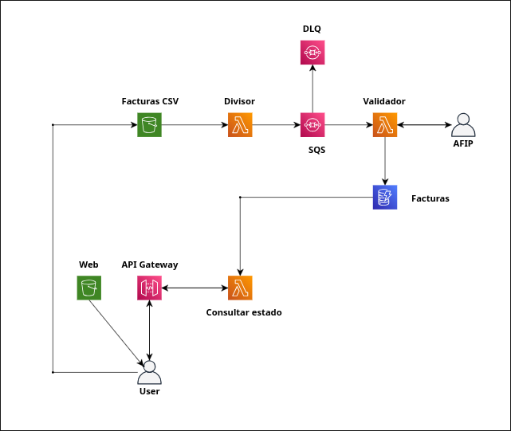

# Servicio validador de facturas

**Cloud Computing - Licenciatura en Sistemas, UNRN**<br>
**Integrantes:** Acosta Tomas, Antrichipay Daniel, Cabeza Franco

Este proyecto implementa un sistema serverless para cargar lotes de facturas desde un sitio web, subir archivos Excel directamente a Amazon S3 y validar cada factura de forma asincronica. La validacion se realiza con un mock de AFIP/ARCA y los resultados quedan disponibles para consulta desde la interfaz web.

La solucion se despliega en AWS mediante AWS SAM. Para el despliegue y las pruebas se utilizan AWS CLI, SAM CLI y Docker. El sitio estatico se publica en S3, la API se expone con API Gateway, el procesamiento se ejecuta con AWS Lambda, los mensajes se administran con SQS y los resultados se almacenan en DynamoDB.

## Diagrama de arquitectura


## Arquitectura

El stack de AWS SAM crea los siguientes recursos principales:

- `WebBucket`: bucket S3 para alojar el sitio estatico.
- `UploadsBucket`: bucket S3 privado para recibir los archivos Excel.
- `FacturasTable`: tabla DynamoDB single-table para lotes y facturas.
- `InvoicesQueue`: cola SQS principal para procesar facturas.
- `InvoicesDLQ`: cola SQS de mensajes fallidos.
- `FacturasApi`: API Gateway REST para generar URLs prefirmadas y consultar resultados.
- `ApiFunction`: Lambda que genera `batchId`, URLs prefirmadas y expone las consultas.
- `ParserFunction`: Lambda que lee el Excel, actualiza metadata del lote y envia mensajes a SQS.
- `ValidatorFunction`: Lambda que consume SQS, valida con el mock AFIP/ARCA, guarda facturas y actualiza contadores.
- `CommonLayer`: layer con codigo propio compartido por las Lambdas.

## Flujo

1. El frontend llama a `POST /batches/upload-url` con el nombre del Excel.
2. `ApiFunction` genera `batchId`, `s3Key` y URL prefirmada.
3. El navegador sube el Excel directo a `UploadsBucket`.
4. El evento S3 dispara `ParserFunction`.
5. `ParserFunction` lee la primera hoja, ignora filas vacias, crea/actualiza la metadata del lote y luego envia una factura por mensaje a SQS.
6. `ValidatorFunction` consume SQS, ejecuta el mock AFIP/ARCA y guarda cada factura en DynamoDB.
7. `ValidatorFunction` actualiza contadores y marca el lote como `COMPLETED` o `COMPLETED_WITH_ERRORS`.
8. El frontend consulta `GET /batches/{batchId}` y `GET /batches/{batchId}/invoices`.
9. La tabla de facturas se pagina con `limit` y `nextToken`; el frontend guarda los tokens visitados para permitir volver a la pagina anterior.

## Modelo DynamoDB

Tabla single-table:

```text
PK: batchId
SK: entityKey
```

Lote:

```text
batchId = <uuid>
entityKey = BATCH
```

Factura:

```text
batchId = <uuid>
entityKey = INVOICE#0001-00000001
```

Las consultas usan `GetItem` y `Query`; no se usa `Scan`.

## Estructura

```text
.
├── functions/
│   ├── api/
│   ├── parser/
│   └── validator/
├── layers/
│   └── common/
│       └── python/
│           └── common/
├── web/
├── events/
├── scripts/
├── template.yaml
├── samconfig.toml
└── README.md
```

La carpeta `layers/common` contiene solo codigo propio compartido.

## Prerrequisitos

- Cuenta o laboratorio de AWS con credenciales activas.
- AWS CLI instalado.
- AWS SAM CLI instalado.
- Docker instalado y corriendo.
- Permisos para crear y administrar los recursos definidos en `template.yaml`.
- En AWS Academy/Vocareum, iniciar el laboratorio y copiar las credenciales vigentes antes de desplegar o probar.

El template usa por defecto el rol `LabRole`, parametrizado mediante `LambdaRoleName`.

Verificar Docker:

```bash
docker ps
```

Si `docker ps` falla, iniciar Docker antes de usar `sam build --use-container`.

## Configurar credenciales AWS

Configurar AWS CLI con las credenciales de la cuenta o del laboratorio:

```bash
aws configure
```

Completar los campos de la siguiente forma:

```text
AWS Access Key ID [None]: <AWS_ACCESS_KEY_ID>
AWS Secret Access Key [None]: <AWS_SECRET_ACCESS_KEY>
Default region name [None]: us-east-1
Default output format [None]: json
```

En AWS Academy/Vocareum, los valores se obtienen desde la seccion de credenciales del laboratorio, normalmente en el bloque `AWS CLI`. Tienen esta forma:

```text
aws_access_key_id = ASIA...
aws_secret_access_key = ...
aws_session_token = ...
```

Si las credenciales incluyen token de sesion, configurarlo tambien:

```bash
aws configure set aws_session_token "<AWS_SESSION_TOKEN>"
```

Reemplazar:

- `<AWS_ACCESS_KEY_ID>` por el valor `aws_access_key_id`.
- `<AWS_SECRET_ACCESS_KEY>` por el valor `aws_secret_access_key`.
- `<AWS_SESSION_TOKEN>` por el valor `aws_session_token`.

Verificar que AWS CLI esta usando las credenciales correctas:

```bash
aws sts get-caller-identity
```

## Despliegue en AWS

1. Validar el template:

```bash
sam validate
```

2. Compilar con Docker:

```bash
sam build --use-container
```

Si no esta instalado Python 3.12 localmente, usar siempre `sam build --use-container`.

3. Desplegar con SAM:

```bash
sam deploy --guided
```

Valores recomendados para el despliegue guiado:

```text
Stack Name: servicio-validador-facturas
AWS Region: us-east-1
Parameter LambdaRoleName: LabRole
Confirm changes before deploy: Y
Allow SAM CLI IAM role creation: n
Capabilities: CAPABILITY_IAM
Disable rollback: N
ApiFunction has no authentication. Is this okay?: y
Save arguments to configuration file: Y
SAM configuration file: samconfig.toml
SAM configuration environment: default
```

Importante: si se responde `n` en `ApiFunction has no authentication. Is this okay?`, SAM corta el deploy con:

```text
Error: Security Constraints Not Satisfied!
```

En este proyecto la API queda sin autenticacion porque es una practica/lab. Para continuar, responder `y`.

Tambien se puede usar el script:

```bash
./scripts/deploy.sh
```

El script ejecuta:

```bash
sam build --use-container
sam deploy --guided
```

4. Al finalizar el deploy, anotar los outputs:

- `ApiEndpoint`: URL base de la API.
- `WebBucketName`: bucket del sitio estatico.
- `WebSiteUrl`: URL HTTP del sitio estatico.
- `UploadsBucketName`: bucket privado de uploads.
- `FacturasTableName`: tabla DynamoDB.
- `InvoicesQueueUrl`: cola SQS principal.

Si el comando de CloudFormation esta permitido, se pueden ver con:

```bash
aws cloudformation describe-stacks \
  --stack-name servicio-validador-facturas \
  --query "Stacks[0].Outputs"
```

## Publicar el frontend

Luego del deploy, sincronizar `web/` al bucket de sitio:

```bash
./scripts/sync-web.sh servicio-validador-facturas
```

El script lee los outputs `ApiEndpoint` y `WebBucketName` del stack, genera un `config.js` temporal con la API de ese despliegue y sincroniza el sitio al bucket correcto. Cada persona que despliegue el stack genera su propia configuracion, por lo que el frontend no queda apuntando a una API ajena.

Si el script no puede leer CloudFormation por permisos del laboratorio, usar los outputs que mostro `sam deploy` y sincronizar manualmente:

```bash
tmpdir="$(mktemp -d)"
cp -R web/. "$tmpdir/"
cat > "$tmpdir/config.js" <<EOF
window.APP_CONFIG = {
  apiBaseUrl: "<ApiEndpoint>"
};
EOF
aws s3 sync "$tmpdir/" "s3://<WebBucketName>"
rm -rf "$tmpdir"
```

Reemplazar:

- `<ApiEndpoint>` por una URL con esta forma:

```text
https://<api-id>.execute-api.<region>.amazonaws.com/prod
```

- `<WebBucketName>` por el nombre del bucket de sitio estatico.

El frontend resuelve la URL base de la API en este orden:

1. `window.APP_CONFIG.apiBaseUrl`, generado por `sync-web.sh`.
2. Valor editado manualmente y guardado en `localStorage`.
3. `http://127.0.0.1:3000` como fallback para desarrollo con `sam local start-api`.

El Excel no pasa por API Gateway ni por la Lambda API: el navegador pide una URL prefirmada y sube el archivo directo a S3.

## Pruebas en AWS

1. Abrir el sitio estatico con `WebSiteUrl`.
2. Subir un archivo `.xlsx`.
3. Verificar que la UI muestre `Archivo subido correctamente`.
4. Confirmar que el `batchId` se carga en el campo `Batch ID`.
5. Presionar `Consultar`.
6. Volver a presionar `Consultar` para ver el avance del lote.
7. Revisar la tabla paginada de facturas.

Tambien se puede probar el endpoint de upload con `curl`:

```bash
curl -i -X POST \
  "<ApiEndpoint>/batches/upload-url" \
  -H "Content-Type: application/json" \
  -d '{"fileName":"prueba.xlsx"}'
```

Una respuesta correcta devuelve `201` con:

```json
{
  "batchId": "...",
  "s3Key": "uploads/.../prueba.xlsx",
  "uploadUrl": "...",
  "uploadMethod": "PUT",
  "uploadHeaders": {
    "Content-Type": "application/vnd.openxmlformats-officedocument.spreadsheetml.sheet"
  }
}
```

## Diagnostico en AWS

Ver configuracion de la Lambda API:

```bash
aws lambda get-function-configuration \
  --function-name servicio-validador-facturas-api \
  --query "{State:State,LastUpdateStatus:LastUpdateStatus,Runtime:Runtime,Handler:Handler,Role:Role,Env:Environment.Variables}"
```

Ver configuracion del parser y obtener `QUEUE_URL`:

```bash
aws lambda get-function-configuration \
  --function-name servicio-validador-facturas-parser \
  --query "Environment.Variables"
```

Ver mensajes pendientes en SQS:

```bash
aws sqs get-queue-attributes \
  --queue-url "<InvoicesQueueUrl>" \
  --attribute-names ApproximateNumberOfMessages ApproximateNumberOfMessagesNotVisible ApproximateNumberOfMessagesDelayed RedrivePolicy
```

Ver logs de la Lambda API:

```bash
aws logs tail /aws/lambda/servicio-validador-facturas-api \
  --since 30m
```

Ver logs del validator:

```bash
aws logs tail /aws/lambda/servicio-validador-facturas-validator \
  --since 2h
```

## Pruebas locales

Verificar Docker:

```bash
docker ps
```

Ejecutar API local:

```bash
sam local start-api
```

Invocar eventos:

```bash
sam local invoke ApiFunction -e events/api-create-upload-url.json
sam local invoke ParserFunction -e events/s3-object-created.json
sam local invoke ValidatorFunction -e events/sqs-invoice-batch.json
```

`sam local` ejecuta las Lambdas con Docker, pero no crea S3, SQS ni DynamoDB localmente. Sin LocalStack, las pruebas reales de S3/SQS/DynamoDB se hacen desplegando el stack en AWS.
